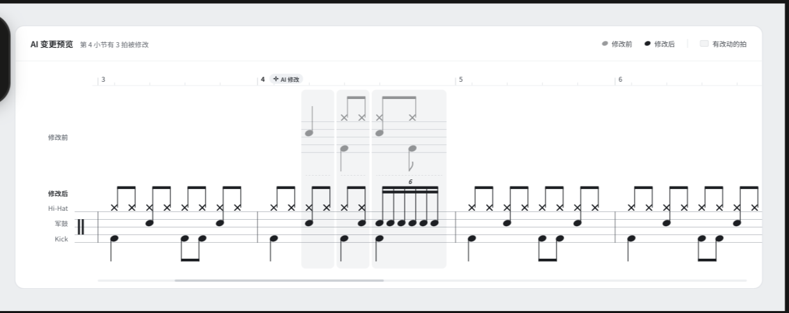

# AI Music Project — Master Notes

> 最後更新：2026-10-04
> 這是專案的唯一正文。原始整理保存在 `sources/`：ChatGPT 版 `chatgpt-summary-2026-10-04.md`、Claude 版 `claude-summary-2026-10-04.md`。
> 狀態標記：**明確決策**＝使用者明確選定／**討論提案**＝提過但沒定案／**待確認**＝有傾向或前提但未拍板，或屬調研資訊需自行驗證／**已被取代**＝曾提出，但後來的決策讓它不再適用／**暫緩**＝使用者決定之後再處理。
> 來源標記：[G#]＝ChatGPT 聊天，[C#]＝Claude 聊天（編號對照見文末「來源」）；[確認 10-04]＝使用者在 2026-10-04 合併兩份筆記時親自確認。

## 摘要

給鼓手用的轉譜和編輯工具：**上傳音訊 → 自動轉成鼓譜 → 在 Mac 原生 App 裡修正**，並且可以用說話（或文字）請 AI 改譜。網頁版只能瀏覽樂譜，不能編輯。先做鼓譜，之後擴充到吉他、鋼琴等其他樂器，所以編輯器和資料模型從一開始就要考慮多樂器。

目前確定的技術選擇有兩項：

- 轉譜引擎用 **Klangio API**。[確認 10-04]
- 後端用 **Cloudflare serverless**。[確認 10-04]

商業模式是 **open-core**：樂譜模型、MIDI／MusicXML、Patch、Diff 和本地編輯器開源；AI、雲端、同步、協作和 AI 轉譜收費，轉譜沒有免費額度。樂譜存在**使用者自己的 GitHub repo** 做版本控制，Mac App 裡有一個按鈕可以直接存檔並 commit；把網址裡的 github.com 換成我們的網域，就會在網頁檢視器裡看到那份譜。[確認 10-04]

架構定為「一份 TypeScript 核心＋Mac／Windows 的 WebView 外殼」，排版引擎用 **Verovio**（搭配逐行快取）；資料庫、STT、LLM 供應商，以及 Jev 是否採用，都還沒定案。

```text
上傳音訊 ─► Klangio API 轉譜 ─► 後處理／轉入內部模型 ─► 編輯器（五線譜）
                                                          ▲
使用者文字／語音 ─► Cloudflare Worker（API／orchestration）    │
                    ─► deterministic rules ─► Jev（候選）     │
                    ─► Router ─► Music Agent／LLM            │
                    ─► 結構化 Patch（符合 schema 的小編輯）    │
                    ─► 驗證 ─► 套用 ─► 新版本（beat 級 diff）─┘
```

上圖把兩邊的討論接在一起，畫的是目前的方向。除了上面兩項已確定的選擇，其餘元件都還是提案。

## 1. Product Vision

- **已被取代**　原本定的是「給鼓手用的網頁工具」：上傳音訊 → 自動轉成鼓譜 → 在內建編輯器手動修正。流程不變，但編輯改到 Mac 原生 App 裡做（見下一條）。[C2][確認 10-04]
- **明確決策**　編輯只在 Mac 原生 App（Local Editor）裡做，之後會有 Windows 版；網頁版只能瀏覽樂譜，不能編輯。[確認 10-04]
- **明確決策**　iPhone、iPad 只提供閱讀，不能編輯。[確認 10-05]
- **明確決策**　先做鼓譜，之後擴充到吉他、鋼琴和其他樂器。編輯器和資料模型要先考慮到未來的其他樂器，保留擴充性。[確認 10-04]
- **明確決策**　目標是商業化。[C2]
- **明確決策**　商業模式採 open-core：核心開源，AI 和雲端服務收費。切分見第 10 節。[確認 10-04]
- **明確決策**　用使用者修正後的資料，回頭改善辨識能力（資料飛輪）。[C2]
- **明確決策**　使用者可以用說話（與 AI 對話）的方式修改鼓譜。[C4][C5]
- **討論提案**　產品是「修改既有的譜」，和「輸入描述、生成整首歌」的 AI 音樂生成產品（例如 ElevenLabs Music）是不同的問題。[G5]
- **待確認**　差異化方向：以轉譜 API（Klangio）當引擎，把編輯體驗（聽著選、批次修正、標示不確定的地方）和修正回饋做成賣點。使用者回應「聽起來蠻合理」，但沒有正式定案。[C2]
- **討論提案**　市場定位：「上傳你的錄音，把練習轉成譜」（鼓手練習、老師出教材、樂團記錄自己的編曲）比「一鍵取得任何歌曲的鼓譜」在版權上安全，而且這群客人的付費意願不低。[C2]
- **討論提案**　作品集價值：語音編輯（應用架構）＋資料飛輪（評估）＋Klangio 整合與上線（系統設計），可以串成一個完整的 AI 工程作品。[C7]
- **待確認**　競品調研（需自行驗證）：
  - Klangio Drum2Notes：有 API、線上編輯器，可匯出 MusicXML／MIDI／PDF；App Store 評分約 3.8，有使用者抱怨結果和原曲無關。
  - Paradiddle：三個模型投票，公開的 F1 為 0.86，會標示不確定的擊點讓使用者確認，並拿來當訓練資料；沒看到對外 API；使用者當時找不到它的網站。
  - DrumScript（開源、規則式）、AnthemScore（編輯功能弱）、Drumscrib、DrumConvert、NotaGen。[C2]
- **待確認**　宣傳影片已經做好（30 秒、1080p），用的是暫定名「打譜」和 slogan「上傳 轉譜 開打」。影片把語音編輯呈現成已經有的功能。[C9]

## 2. UX / User Flow

### 轉譜與修正

- **明確決策**　主流程：上傳音訊（可以是整首歌）→ 自動轉譜 → 進入內建編輯器修正。[C2] 編輯器現在是 Mac 原生 App。[確認 10-04]
- **明確決策**　模型沒把握的地方，提供 2–3 個候選方案，每個附一小段譜（約 2–4 小節）和對應的音訊，讓使用者聽著選。使用者表示「這就是我理想的狀況」。[C2]
- **明確決策**　編輯器以五線譜呈現。[C2]
- **討論提案**　需要人確認的項目和順序：拍號與小節起點 → tempo 倍數（半速／倍速）→ 網格解析度（十六分 vs 三連音）→ 鼓的類別（tom／snare、ride／hi-hat）→ 重音。前面錯了會一路影響後面。[C2]
- **討論提案**　候選片段挑鼓最密、最穩的段落（通常是副歌），不要用前奏；播放時在小節開頭加提示音或讓畫面閃一下。[C2]
- **討論提案**　拍號預設 4/4。可以手動改拍號、在特定小節插入變拍、拖動小節線，或指定「以這一擊為第一拍」。[C2]
- **討論提案**　編輯器互動：
  - 播放時游標同步移動，可以單小節循環
  - 鍵盤操作：數字鍵對應鼓種、方向鍵移動、空白鍵播放
  - 批次編輯：複製到相似的小節，或一次把某個位置的 tom 全部改成 snare
  - 低信心的擊點用顏色標示
  [C2]
- **討論提案**　等待時的體驗：
  - 依 pipeline 的階段回報進度
  - 每處理完約 30 秒就先出那一段的譜，讓使用者先開始編輯
  - 先用能量法給一個粗略的擊點預覽
  - 做成任務列表，加上完成通知
  [C2]
- **討論提案**　譜面渲染元件（這些是在「網頁編輯器」的前提下提的；改成 Mac App 編輯之後，技術選型見 `research/frontend-tech-2026-10.md`）：
  - VexFlow：吃自己的資料來畫譜，編輯互動要自己做
  - OpenSheetMusicDisplay：吃 MusicXML，比較美觀，但編輯一樣要自己處理
  - Flat.io：可以嵌入，但要付費
  - 也可以選 Songsterr 那種格線／tab 介面
  [C2]
- **討論提案**　使用者提出：開始前讓使用者把每個鼓各打幾下，錄成音色模板。Claude 建議只在信心低時當輔助校正（用 MFCC／梅爾頻譜比對），而且只適用單獨錄的鼓聲，混音不適用。[C2]

### AI 修改的流程

- **討論提案**　使用者用文字或語音描述需求 → 系統判斷意圖 → 需求模糊就先反問，清楚就進入對應的 Agent 或流程 → 產生結構化修改 → 使用者預覽、接受後套用，存成新版本。[G2]

## 3. MVP Scope

- **待確認**　使用者還沒有明確界定 MVP 範圍。[C2][G1]
- **討論提案**　快速做出 MVP 可以靠 Klangio API（現在已確定使用）。[C8]
- **討論提案**　先做出意圖分類和路由，之後再逐步加入 reranker 和 Patch system。[G2]
- **討論提案**　力道只分 2–3 級（重音／普通），不做連續數值。[C2]
- **討論提案**　Claude 排過一份 16 週的時程，和課程綁在一起：
  - W1：串接 Klangio API
  - W2：定義鼓譜操作工具的 schema
  - W3：準備 100 句口語指令的測試集
  - W4：量測指令解析的準確率
  - W5：接上 STT，完成「說話 → 指令 → 改譜」
  - 第二階段（10/26–11/22）：做出語音編輯 MVP
  [C7]
- **已被取代**　「先不做 Demucs」「先跑原始模型、不先微調」：這兩點是在自建模型的前提下討論的。改用 Klangio 之後，這些變成日後自建模型時才需要考慮的事。[C2]

## 4. Internal Music Model

- **明確決策**　資料模型和編輯器要能擴充到其他樂器（吉他、鋼琴等），不能把「鼓」寫死在核心結構裡。[確認 10-04]
- **明確決策**　內部的樂譜模型叫 **Canonical Score Model**，屬於開源部分；和它一起開源的還有 MIDI、MusicXML 的轉換，以及 Patch、Diff。[確認 10-04]
- **討論提案**　三層資料模型（Canonical Score Model 的結構候選）：[C2]
  1. 原始偵測：時間點、鼓的類別、信心分數。永遠不修改。
  2. 量化後的譜：第幾小節第幾拍、音符長度。可以重算。
  3. 使用者的編輯操作紀錄：刪除擊點、tom 改 snare、新增擊點等。不覆蓋中間那層。
- **討論提案**　模型的輸出先存成中性的中間格式（時間＋類別＋信心）。量化邏輯改了可以直接重跑，不用重新推論。[C2]
- **討論提案**　編輯器內部用自訂的 JSON 結構，不直接操作 MusicXML 或 MIDI，匯出時才轉換。[C2]
- **討論提案**　匯出格式：MIDI 和 MusicXML 兩種都做（開放標準、有現成的函式庫）。另外，Guitar Pro 格式對鼓手很實用；ABC notation 不適合鼓譜；MuseScore 的格式是封閉的。[C2]
- **待確認**　ChatGPT 那邊的範例把 `score_format` 寫成 `MusicXML`，那只是 payload 範例，不代表選定。[G2]
- **待確認**　要擴充到多樂器，核心模型如何分出「樂器無關」的部分（小節、拍、時值、聲部、版本）和「各樂器專屬」的部分（鼓的類別、吉他的弦／品、鋼琴的音高與踏板）？還沒討論過。

## 5. Audio → Transcription → Score

- **明確決策**　轉譜引擎用 Klangio API。[G1][確認 10-04]
- **明確決策**　離線辨識就好，不做即時串流。[C2]
- **待確認**　Klangio 的整合細節：[C8][G1]
  - 確切的產品和端點
  - 單檔有 300 秒的限制，要先切段
  - 輸出格式：MIDI、MusicXML、PDF、GP5
  - 用 callback 還是輪詢
  - 錯誤處理和費用
  - 鼓譜的實際品質
  - 服務條款是否允許用它的輸出訓練模型
- **討論提案**　如果引擎只輸出 MIDI，需要後處理（量化、推斷拍號、分離聲部），再用 MuseScore CLI 或 Verovio 渲染。[C8]
- **討論提案**　準確度評估：用 precision／recall／F，容錯窗 ±50ms，分鼓種看（hi-hat 通常比較低）。標準答案可以用使用者修正後的資料。[C2]
- **討論提案**　拍號可以用重音的週期來推估，但變拍（例如 progressive metal）自動判斷不可靠，要交給人確認。[C2]
- **討論提案**　語音轉文字（STT，例如 ElevenLabs Scribe）和音樂轉譜是兩件不同的事，要分開處理。[G5]

### 自建模型路線（現在是備案或日後選項）

以下是在「自己跑模型」的前提下討論的。改用 Klangio 之後，這些變成備案，或之後要自建模型時的參考。哪些步驟 Klangio 已經做掉、哪些仍要自己做（例如量化、校正），還沒確認。

- **討論提案**　Pipeline：ffmpeg 統一格式（單聲道、固定取樣率）→（可選）Demucs 分離鼓軌 → 轉譜模型抓擊點和鼓的類別 → 估計 tempo／beat tracking → 動態選網格量化 → 切分小節 → 計算音符長度 → 渲染鼓譜 → 收集使用者修正。已經做了一份 ELI5 的單頁 HTML 圖解。[C1][C2]
- **待確認**　ADTOF：開源的主流基準，分 5 類鼓（大鼓、小鼓、hi-hat、tom、銅鈸），用 CRNN，多標籤可以處理同時擊打。但程式碼是 CC BY-NC-SA 4.0，資料集也限非商業使用，不能直接商用。可行的路線：寫信向作者 Matthias Zehren 談商業授權、依論文自己訓練，或改接商用 API（現在選了 Klangio）。[C2]
- **待確認**　其他鼓轉譜選項（需自行驗證）：
  - DrumScript：規則式，輸出 PDF／MIDI／MusicXML，授權待查
  - DrummerScore：MIT 授權，但只是學士論文的 notebook，沒經過標準評測
  - ADTLib：只分 3 類，比較舊
  - ADTOF-pytorch：授權可能有一樣的問題
  - Enhanced ADT via Drum Stem Source Separation：8 類加力道，研究授權
  - Noise-to-Notes、STAR Drums
  - Moises、Music AI 的鼓譜表現不明；Basic Pitch 不適合鼓
  [C2]
- **待確認**　通用轉譜服務比較（需自行驗證）：
  - Mirelo Audio-to-MIDI Pro API：有官方 Node.js／TypeScript SDK，支援多樂器
  - Transkun：鋼琴專用，MIT 授權，可以轉 ONNX
  - Spotify Basic Pitch：Apache-2.0，有 npm 套件，只輸出 MIDI
  - MuScriptor：權重是 CC BY-NC 4.0，不能商用
  其中鋼琴和多樂器的選項，之後擴充樂器時可以再拿出來看。[C8]
- **討論提案**　Demucs（htdemucs）負責「分離」，ADTOF 負責「辨識」，前後串接。Demucs 很吃資源（用 CPU 跑一首可能要幾分鐘），而且會留下 artifact。編曲厚重時（例如金屬）有幫助，乾淨的編曲（例如爵士三重奏）反而會變差。要不要跑 Demucs，可以用音訊統計特徵分流，也可以兩路都跑、比較信心分數或把結果融合。[C2]
- **討論提案**　量化：假設十六分、三連音、三十二分等網格，以小節或半小節為單位，選誤差最小的那個；網格越細，懲罰越重。真人打鼓的 tempo 會飄，所以需要 beat tracking。[C2]
- **討論提案**　打不準時的校正：
  - 低信心的擊點放寬吸附
  - 用各小節之間重複的 pattern 互相校正
  - 分層處理：先定大鼓／小鼓的骨架，再對 hi-hat
  - 不確定時回頭看音訊的能量曲線找峰值
  [C2]
- **討論提案**　力道（velocity）：ADTOF 不提供。可以從擊點附近的短時能量估計，分頻段處理重疊、用局部視窗正規化；或改用以 E-GMD 訓練的 Onsets and Frames Drums，力道比較準。[C2]

## 6. AI Agent Architecture

### 整體路由（ChatGPT 的討論）

```text
User request
  → deterministic rules（明確、可以寫成規則的指令）
  → Jev Decision Layer（意圖／複雜度／是否需要深度推理）
  → Router
      ├─ Music Agent
      ├─ RAG / search Agent
      ├─ transcription workflow
      └─ general LLM
  → Agent / LLM 產生結構化 Patch
  → Music Engine 驗證並套用
  → 建立 Revision
```

- **討論提案**　Jev 是做決策和路由的那一層，不是主要的生成式 LLM。應用程式自己控制 threshold、fallback、retry 和實際的動作。[G2]
- **討論提案**　簡單、明確的指令直接走 deterministic rules；複雜的交給能力比較強的 Agent 或 LLM；不明確的就反問或 fallback。[G2]
- **討論提案**　API flow 由後端控制，前端不直接呼叫 Jev。用 provider abstraction 包起來，之後可以換掉決策模型。[G2]
- **討論提案**　Jev 意圖的範例：`music_edit`、`music_question`、`transcription`、`search`、`general_chat`（只是範例，不是最終的分類表）。[G2]

### 語音編輯流程（Claude 的討論）

- **討論提案**　三段式流程（使用者自己描述、Claude 確認過）：語音轉文字 → Jev 判斷要做什麼修改（新增／刪除／修改音符、調速度等）→ 把分類結果和原句交給 LLM 抽出參數（小節、拍、音符類型），產生結構化指令 → 自己的程式執行改譜。[C4][C6]
- **討論提案**　類似 Cursor 的設計：模型不重寫整份譜，只輸出符合 schema 的小編輯（action、target range、parameters），允許的動作像是 replace pattern、change tempo、add fill、delete bars。實際的修改由自己的程式執行，模型不直接碰譜。[C5]
- **討論提案**　分兩輪取上下文：第一輪只給選取的小節，加上整首歌的結構大綱（主歌、副歌在哪幾小節）。資訊不夠時，模型回傳一個「要資料」的動作（和編輯動作放在同一個 schema 裡），程式補上指定的小節再跑第二輪。[C5]
- **討論提案**　套用前先驗證（小節存不存在、pattern 支不支援），不符合就拒絕。[C5]
- **討論提案**　信心門檻：看最高分的絕對值，以及第 1、2 名的差距。
  - 分數高但差距小 → 反問使用者二選一
  - 分數普遍偏低 → 告訴使用者聽不懂（超出範圍）
  - 後端回傳「需要澄清」的狀態，附上前兩個候選意圖，前端轉成問句。使用者選完後連同原句送回，跳過分類直接執行。
  [C6]
- **討論提案**　語音編輯本質上是「一句話 → 一個或幾個工具呼叫」，用不到長時間、多步驟的重型 agent 架構。[C7]
- **已被取代**　「在 NestJS 裡把 Jev 當成一個 service 呼叫」：後端已經定為 Cloudflare serverless，改成由 Worker 呼叫。[C4][確認 10-04]

### Jev

- **待確認**　Jev（TypeSafe AI，目前是 early access）只輸出固定形式（選項、分數、是非），不能抽取任意數值，也不能輸出 MusicXML 這類自由格式。官方宣稱比前沿模型快 40–200 倍、便宜 40–400 倍，接之前要自己測過。[C4]
- **討論提案**　Jev 的價值在成本、延遲，以及不會冒出沒定義過的動作。如果指令種類不多，一開始只用 LLM 加上嚴格的 schema 也夠了。[C6]
- **待確認**　兩邊的討論把 Jev 放在不同層：ChatGPT 那邊用它做**最上層的路由**（編輯、問答、轉譜、搜尋、閒聊）；Claude 那邊用它做**編輯指令的分類**（新增、刪除、修改、調速度）。兩者可以並存，也可以只選一層，還沒決定。[G2][C4]

### 工具

- **討論提案**　ChatGPT 那邊舉的工具例子：`read_score()`、`modify_measure()`、`add_note()`、`delete_note()`、`transpose()`、`play_preview()`、`search_music()`、`get_version()`。[G4]
- **討論提案**　Claude 那邊舉的鼓譜工具例子：加音、刪音、改樂器、改力度，例如 `add_hit(measure=3, beat=2, instrument="snare")`。[C7]
- **待確認**　考慮到之後要支援多樂器，工具 schema 要分成「通用」和「各樂器專屬」兩部分，還沒設計。
- **討論提案**　（選做）把鼓譜編輯功能包成 MCP server。[C7]

## 7. Text / Voice Editing

- **明確決策**　要做語音編輯：使用者說話 → 轉文字 → 指令 → 修改鼓譜。[C4][C5]
- **討論提案**　自然語言的文字指令也是入口之一，和語音走同一套意圖判斷與 Agent 流程。這在 ChatGPT 那邊討論過，Claude 那邊沒提到。[G2]
- **討論提案**　錄音時，同時把目前選取的小節、tempo 等當成上下文一起帶上。[C5]
- **待確認**　指令套用的範圍：有選取時以選取範圍為準（使用者提出、Claude 同意）；沒選取，但話裡有講明（「第十二小節」「最後四小節」）就照講的做。[C6]
- **待確認**　STT 的選擇：
  - 本地 Whisper：不按音訊秒數付費
  - GCP 語音轉文字
  - ElevenLabs Scribe
  原則都是只把轉出來的短句送給模型。後端定為 Cloudflare 之後，要重新評估哪個適合。[C4][C5][G5]
- **討論提案**　準備 100 到幾百句口語指令當測試集，例如：
  - 「把第十小節第四拍補上一個四連音」
  - 「第三小節的小鼓改輕一點」
  - 「把那個 fill 刪掉」
  - 「make bar twelve a half-time shuffle」
  [C4][C5][C7]

## 8. Diff / Versioning

- **明確決策**　AI 的改動以「拍（beat）」為單位，呈現「修改前／修改後」，不逐音符標示新增或刪除，避免六連音這類密集段落看起來很亂。[C10]
- **明確決策**　Patch 和 Diff 屬於開源部分；產生 Patch 的 AI 屬於收費部分。[確認 10-04]
- **討論提案**　beat 級的 mockup 截圖：

  

  畫面是「AI 變更預覽：第 4 小節有 3 拍被修改」，顯示第 3–6 小節，分 Hi-Hat、小鼓、Kick 三列。第 4 小節標了「AI 修改」，第 2–4 拍有淺色底框，上方多一列灰色的「修改前」；其中第 4 拍改成小鼓六連音。右上角圖例：修改前（灰）、修改後（黑）、有改動的拍（淺底）。截圖裡沒有「接受／還原這一拍」的按鈕。[確認 10-04]
- **討論提案**　beat 級 mockup 的設計說明：主譜顯示「修改後」，只有被改的那一拍上方多一列淡化的「修改前」。用淡灰藍背景框住同一拍的兩個版本，中間用虛線分隔；密集的拍自動變寬，並按時間對齊。[C10]
- **討論提案**　每個被改的拍都提供「接受／還原這一拍」，讓審閱的單位和呈現的單位一致（Claude 的建議）。[C10]
- **討論提案**　流程是：模型產生結構化 Patch → Music Engine 驗證並套用 → 建立 Revision。另外有 `get_version()` 工具可以查版本。[G2][G4]
- **待確認**　使用者用「同一個 commit」來描述一批 AI 改動，表示改動是以 commit 為單位。這和 ChatGPT 那邊說的 Revision 應該是同一個概念，名稱要統一；commit 的定義和資料結構都還沒討論。[C10][G2]
- **討論提案**　使用者的修正以一筆一筆的「編輯操作」儲存（三層模型的最上層），可以復原，也可以拿來比對模型錯在哪。[C2]
- **討論提案**　語音編輯用可復原的操作來套用並高亮顯示，使用者可以說「不對，復原」。[C5]
- **已被取代**　音符級的 diff 版本（綠色＝新增、半透明紅＝刪除，拍的背景改成中性色並標上 `+2`／`+1 −1`；同位置、同樂器「刪了又加回」的改動合併成「修改」狀態），已經被 beat 級的設計取代。[C10]

## 9. Local-first / GitHub 版控 / 音訊儲存

### 樂譜存放與版控

- **明確決策**　樂譜用 GitHub 做版本控制，存在**使用者自己的 GitHub repo**，所有權屬於使用者。[確認 10-04]
- **明確決策**　把網址裡的 GitHub 網域換成我們的網域，就會打開我們的**網頁檢視器**，看到同一份譜（只能看）。例如 `github.com/使用者/repo/…` 改成 `我們的網域/使用者/repo/…`。頁面上有「用 Mac App 編輯」的按鈕，所以沒裝 App 的人也看得到譜。[確認 10-04] 網頁顯示的是已發佈的 PDF。[確認 10-05]
- **明確決策**　本地編輯器（Local Editor）是 **Mac 原生 App**，屬於開源部分。[確認 10-04]
- **明確決策**　使用者在 Mac App 裡自己串接自己的 GitHub；App 裡有一個按鈕，按下去就會存檔、commit，完成版本控制。[確認 10-04]

### repo 裡的檔案

- **明確決策**　每首曲子的檔案：[確認 10-04]

  ```text
  songs/<曲名>/
  ├── score.json          ← Canonical Score Model，唯一會被編輯的檔
  ├── score.musicxml      ← 每次 commit 時從 score.json 自動產生（給 MuseScore 等軟體開）
  └── transcription.json  ← Klangio 的原始轉譜結果，只寫一次，永不修改
  ```

  - MIDI 不進 repo，要用時再匯出。
  - 音訊不進 repo（存放方式另外決定，見下方「音訊」）。
  - 只有 `score.json` 會被編輯。MusicXML 是匯出的快照，所以不會發生「兩個檔不一致、哪個才對」的問題。
  - 以 JSON 為主，是因為 MusicXML 放不下信心分數、AI 修改紀錄，以及之後多樂器的擴充欄位。
- **明確決策**　轉譜完成後，App 直接把 Klangio 的原始結果做成**第一個 commit** 並 push。之後 `transcription.json` 不會再被修改，後續的編輯結果都存成新的 commit。[確認 10-04]

### 音訊

- **討論提案**　音訊處理的三種做法：[C2]
  - (a) 純本地：ADTOF 轉成 ONNX，用 onnxruntime-web 在瀏覽器跑。
  - (b) 暫時上傳，處理完就刪，只留下譜。
  - (c) 音訊只存在瀏覽器的 IndexedDB。

  Claude 建議 (b)。改用 Klangio 後，音訊一定要送出去，所以 (a) 已經不適用。這三種做法和下面的 hash 設計都是以瀏覽器為前提（File API、IndexedDB）；改成 Mac App 後，App 可以直接讀本地檔案，「雲端不留音檔、用 hash 配對本地檔案」的概念仍然可以沿用（Claude 註記）。
- **待確認**　使用者選擇深入 (b)，並複述了設計：雲端只存音檔的 hash，和譜綁在一起；使用者下次在本地選同一個檔案時，用 hash 配對，再用 File API 在本地播放，不用重新上傳。沒有明確宣告定案。[C2]
- **討論提案**　hash 的細節：[C2]
  - 整檔算 SHA-256 要用 Web Worker，或只算前幾 MB 加上檔案大小。
  - 使用者轉過檔（MP3 ↔ WAV）導致 hash 不符時，只警告、不阻擋。
  - 對外要講清楚是「只上傳一次」，不是完全不上傳。
- **討論提案**　使用者提出：讓使用者把音訊放在自己的雲端空間（例如 Google Drive、Dropbox），服務只在處理時暫時讀取。[C2]
- **待確認**　音訊要不要放進使用者的 GitHub repo？音檔很大，直接放進 git 不適合（可能要用 Git LFS，或音訊另外存放、repo 裡只放 hash）。還沒討論。
- **待確認**　離線編輯、同步衝突怎麼處理，還沒設計。[C2][G1]

## 10. Open-core / Free vs Paid

- **明確決策**　採 open-core，切分如下：[確認 10-04]

  ```text
  Open Source（免費）            Commercial（收費）
  ├── Canonical Score Model      ├── AI
  ├── MIDI                       ├── Cloud
  ├── MusicXML                   ├── Sync
  ├── Patch                      ├── Collaboration
  ├── Diff                       └── AI Transcription
  └── Local Editor
  ```

- **明確決策**　AI 轉譜全部付費，沒有免費額度。免費的只有開源部分。[確認 10-04]
- **明確決策**　付費的 Sync：由我們自動幫使用者同步，使用者不用自己串接外部的 GitHub，隱私性也比較好。**先不做**，第一階段以 GitHub 為主。[確認 10-04]
- **暫緩**　開源部分用哪一種授權，之後再決定。[確認 10-04]
- **已被取代**　使用者原本提出分方案：基本版走單一路徑；進階版有 Demucs、沒有 Demucs 兩路都跑，再比對結果。Claude 建議基本版免費、進階版（兩路融合）收費，兩路結果不一致的地方在編輯器標示「請確認」。這個分法已經被「轉譜全部付費」取代。不過「兩路結果不一致就標示請確認」的做法，日後自建模型時仍可參考。[C2][確認 10-04]
- **待確認**　競品定價（需自行驗證）：Paradiddle 第一首免費，之後付費（沒查到價格）；Drumscrib 每首約 US$1.8–3.6；DrumConvert 訂閱每月約 US$9–29。[C2]
- **待確認**　成本面（需自行驗證）：Klangio API 分級約每月 $0–$499 以上，成本隨用量增加；Mirelo 約每分鐘 €0.11–0.14。[C2][C8]
- **討論提案**　商業化的版權防護：[C2][C7]
  - 上傳前勾選聲明「有權處理這個檔案」（必要，但不夠）。
  - 在多數法域，轉錄別人歌曲的鼓譜可能算衍生作品，收費前建議先問律師。
  - Klangio 的服務條款可能限制用它的輸出訓練競爭模型。

## 11. Backend / Frontend / Infra

### 後端

- **明確決策**　後端用 Cloudflare serverless。[確認 10-04]
- **明確決策**　Cloud、Sync、Collaboration 屬於收費部分（見第 10 節）。[確認 10-04]
- **討論提案**　Cloudflare Worker 當 API 和 orchestration 的入口（範例 endpoint：`POST /chat`），負責呼叫 deterministic rules、Jev、router 和後續的 Agent 或 API。[G2]
- **待確認**　具體要用哪些 Cloudflare 服務（資料庫、物件儲存、佇列、即時狀態），還沒決定。[G2]
- **待確認**　資料庫：先前傾向 Supabase（Postgres + Auth + Storage 一站式；使用者回過「Yeah」，但沒同意記成決策），也比較過自架 VPS + Postgres、Neon（branching）、Firebase、PlanetScale、MongoDB。後端定為 Cloudflare 之後，要重新評估要用 Cloudflare 自己的服務，還是外接 Supabase。[C3]
- **討論提案**　非同步處理：用佇列，前端用輪詢或 WebSocket 拿進度。[C2]
- **討論提案**　上傳：用 presigned URL 直接傳到物件儲存；用儲存桶的生命週期規則（例如 24 小時）自動刪除，處理成功時也主動刪；介面上標示「音訊已刪除」，當作讓使用者安心的訊號。[C2]
- **已被取代**　後端定為 Cloudflare 之後，以下提案不再採用：
  - Python 推論服務 + NestJS gateway [C2]
  - GCP Cloud Run GPU workers + Pub/Sub [C8]
  - 用 Vercel 或 Render 部署後端 [C3]
- **待確認**　GPU 服務（RunPod、Modal、Replicate；Replicate 有託管的 Demucs）以及 ADTOF 可以用 CPU 跑，這些只有在之後自建模型時才用得到。[C2]

### 前端

- **明確決策**　編輯器：Mac 原生 App（現在）、Windows（之後），開源。閱讀：網頁、iPhone、iPad，只能看。[確認 10-04][確認 10-05]
- **明確決策**　架構：**一份 TypeScript 核心**（樂譜模型、Patch、Diff、引擎轉接、diff 預覽），Mac 和 Windows 用很薄的 WebView 外殼（Mac：Swift＋WKWebView；Windows：WebView2）。商業邏輯不放在 Swift 或 C# 裡。[確認 10-05]
- **明確決策**　網頁和 iPhone／iPad **只顯示 PDF**，不在這些平台即時排譜，所以排版引擎只跑在 Mac／Windows 編輯器裡。PDF 用編輯器裡同一個引擎產生（Mac：`WKWebView.createPDF`；Windows：WebView2 `PrintToPdfAsync`），所以和編輯器看到的一樣。[確認 10-05]
- **明確決策**　PDF 只在使用者按「發佈」或「匯出」時才產生，不是每次 commit 都產生，讓 repo 保持乾淨。[確認 10-05]
- **已被取代**　研究階段原本傾向 alphaTab（重排快、內建播放、TS 原始碼、MPL 授權），備案 Verovio。研究見 `research/frontend-tech-2026-10.md`、`research/verovio-vs-alphatab-2026-10.md`。
- **明確決策**　**排版引擎用 Verovio，搭配逐行快取。**[確認 10-05] 依據是 spike 的結果（`research/spike-results-2026-10.md`）：
  - Verovio 不用改原始碼就是一般鼓譜寫法。alphaTab 有三個問題要改原始碼才能修：腳的休止符飄在上方、重音畫在下方、open hi-hat 的「o」畫不出來。
  - 搭配逐行快取，兩者都達到「500 小節改一拍 < 100 ms」（p95：alphaTab 34 ms、Verovio 84 ms）。
  - Verovio 的逐行渲染和整份渲染一致；alphaTab 不一致。
  - 我們的 ID 會直接出現在 Verovio 的 SVG 裡。
  - alphaTab 不採用，研究和 spike 的紀錄保留供參考。
- **明確決策**　先做約兩週的 spike，用兩個引擎各寫最小的 Mac 原型（Swift＋WKWebView）比較。[確認 10-05] 關卡：
  - G1：sticking、open hi-hat 的呈現（使用者判斷）
  - G2：500 小節改一拍，在 WKWebView 裡到畫面更新 < 100 ms
  - G3：做得出 mockup 的 diff 預覽
  - G4：點選、播放游標、AI patch 都對得到我們的 ID
  - G5：A4 PDF 的品質（使用者判斷）
  - G6：逐行快取（換行固定、只重畫改到的那一行，跨行元素不出錯）
- **討論提案**　**換行固定**：第一次轉譜時自動決定換行（預設每行 4 小節、段落開新行），之後鎖住；某一行太擠時標示或只從那一行往後局部重排。換行存在 `score.json`。這符合打譜軟體鎖定換行（casting off）的做法，以及鼓譜每行 4 小節、樂句上下對齊的慣例。視窗大小改變時縮放，不重排。（Claude 建議）
- **討論提案**　**類似 React Virtual DOM 的重繪**：以「一行譜」為快取單位（同一行的小節會互相影響寬度，所以不能以小節為單位）。用小節 ID 對齊、用 hash 判斷是否改動，只重排、重畫有改動的那一行，其他行用快取；快取 key＝這一行小節的 hash＋排版設定＋引擎版本。（Claude 建議）
- **已被取代**　「網頁檢視器即時排譜、可能有播放」：改成只顯示 PDF。[確認 10-05]
- **已被取代**　ChatGPT 那邊架構圖裡的 React 前端，以及第 2 節以網頁編輯器為前提的渲染元件（VexFlow、OpenSheetMusicDisplay、Flat.io），要依研究結果重新評估。[G2][C2]

### 開發流程

- **討論提案**　CI 用 GitHub Actions。原本搭配 Vercel／Render 在 push 時自動部署，現在部署目標要改成 Cloudflare。[C3]
- **討論提案**　開發時導入 AI agent：用 Claude Code／Cursor 協助開發，CI 裡讓 agent 做 PR review。[C3]

## 12. AI Feedback → Prompt Iteration

### 辨識的資料飛輪

- **明確決策**　用使用者修正後的資料，回頭改善辨識。[C2]
- **明確決策**　修正資料的來源：比對使用者 repo 裡的第一版（`transcription.json`，第一個 commit）和後續 commit 的編輯結果。[確認 10-04]
- **待確認**　我們的伺服器怎麼讀到使用者的 repo？私有 repo 需要使用者授權讀取權限；使用者同意、隱私條款怎麼寫，也還沒討論。
- **討論提案**　記錄的是「差異」，不只是最後的結果（漏抓、誤抓、類別錯）。優先挑模型信心低、但使用者改動大的樣本。[C2]
- **討論提案**　用 Klangio 時，模型沒辦法重新訓練，飛輪改成下面這樣：[C7]
  1. 加一層後處理修正：先用規則處理（ride 誤判成 hi-hat、fill 時值錯、ghost note 漏抓），資料夠多再換成小模型。
  2. 把 Klangio 的輸出和使用者修正後的版本做 diff，得到結構化的錯誤標註（漏抓、多抓、樂器判錯、時間偏移），依曲風、速度、段落統計。
  3. 把修正後的資料當成自己的測試集：用來評估供應商的更新、比較其他服務、依曲風決定路由。
  4. 持續累積資料，保留日後自建模型的選項。
  5. 問 Klangio 有沒有回饋合作的機制。
- **待確認**　微調自有模型（學習率約為原本的 1/10，凍結前段的特徵層、只解凍最後幾層）：只有自建模型才需要。當時的建議是先不要微調，因為很多問題其實出在量化後處理。[C2]

### Prompt 和指令解析的迭代

- **討論提案**　改善的閉環：使用者回饋 → 收集失敗案例，並對應到 prompt 版本和 trace → 人工或 AI 分類問題 → 建立實驗版的 prompt → 在固定的資料集上跑 evaluation → 確認有改善才發布。[G3]
- **討論提案**　不要因為一個負評就自動修改正式的 prompt。[G3]
- **討論提案**　語音指令的評估：建立口語指令測試集，每次改 prompt 或換模型就自動評分，用數字確認準確率有沒有進步。[C7]
- **待確認**　Langfuse 可以整合 tracing、prompt 管理、使用者回饋、資料集和 evaluation，但只是舉例，還沒決定採用。[G3]

## 13. Decision Log

| 日期 | 決策 | 來源 |
|---|---|---|
| 2026-09-07 | 產品主流程：上傳音訊 → 自動轉譜 → 內建編輯器修正 | [C2] |
| 2026-09-07 | 離線辨識，不做即時串流 | [C2] |
| 2026-09-07 | 目標是商業化 | [C2] |
| 2026-09-07 | 用使用者修正後的資料回頭改善辨識 | [C2] |
| 2026-09-07 | 沒把握的地方提供候選＋音訊＋譜讓人選 | [C2] |
| 2026-09-07 | 編輯器以五線譜呈現 | [C2] |
| 2026-09-17 | 加入語音（對話）編輯 | [C4][C5] |
| 2026-09-29 | AI 的改動以 beat 級「修改前／修改後」呈現 | [C10] |
| 2026-10-04 | 轉譜引擎用 Klangio API | [G1][確認 10-04] |
| 2026-10-04 | 先做鼓譜，之後擴充到吉他、鋼琴等；編輯器和資料模型要能擴充 | [確認 10-04] |
| 2026-10-04 | 後端用 Cloudflare serverless；前端還沒決定 | [確認 10-04] |
| 2026-10-04 | 商業模式採 open-core：Canonical Score Model、MIDI、MusicXML、Patch、Diff、Local Editor 開源；AI、Cloud、Sync、Collaboration、AI Transcription 收費 | [確認 10-04] |
| 2026-10-04 | AI 轉譜全部付費，沒有免費額度 | [確認 10-04] |
| 2026-10-04 | 樂譜存在使用者自己的 GitHub repo 做版控；把網址裡的 GitHub 網域換成我們的網域，就會打開網頁檢視器（只能看，有「用 Mac App 編輯」按鈕） | [確認 10-04] |
| 2026-10-04 | 編輯只在 Mac 原生 App（Local Editor，開源）裡做；網頁版只能瀏覽 | [確認 10-04] |
| 2026-10-04 | 使用者在 Mac App 裡串接自己的 GitHub，按一個按鈕就存檔並 commit | [確認 10-04] |
| 2026-10-04 | repo 檔案：`score.json` 為主、`score.musicxml` 在 commit 時自動產生、`transcription.json` 存 Klangio 原始結果；MIDI 和音訊不進 repo | [確認 10-04] |
| 2026-10-04 | 轉譜完成後，Klangio 原始結果直接做成第一個 commit 並 push，之後永不修改 | [確認 10-04] |
| 2026-10-04 | 資料飛輪的修正資料：比對 repo 裡的第一版和後續 commit | [確認 10-04] |
| 2026-10-04 | 付費 Sync（自動同步、不用串 GitHub）之後再做，先以 GitHub 為主 | [確認 10-04] |
| 2026-10-05 | iPhone／iPad 只閱讀；網頁和 iPhone／iPad 只顯示 PDF，PDF 在發佈或匯出時才產生 | [確認 10-05] |
| 2026-10-05 | 架構：一份 TS 核心＋Mac／Windows 的 WebView 外殼 | [確認 10-05] |
| 2026-10-05 | 排版引擎用 Verovio，搭配逐行快取（spike 結果） | [確認 10-05] |

## 14. 技術棧總覽

| 技術／元件 | 角色 | 狀態 |
|---|---|---|
| Klangio API | 音訊轉譜 | **明確決策**；整合細節待確認 |
| Cloudflare serverless（Workers） | 後端、API orchestration | **明確決策**；要用哪些服務待確認 |
| 使用者自己的 GitHub repo | 樂譜存放、版本控制 | **明確決策** |
| Canonical Score Model、MIDI／MusicXML 轉換、Patch、Diff、Local Editor | 開源核心 | **明確決策**（開源）；授權待確認 |
| 一份 TS 核心＋WebView 外殼（Mac：Swift＋WKWebView；Windows：WebView2） | 編輯器 | **明確決策** |
| Verovio（WASM，跑在 WebView 裡） | 排版引擎（只在編輯器裡跑），搭配逐行快取 | **明確決策** |
| PDF（PDFKit／瀏覽器） | 網頁、iPhone、iPad 閱讀 | **明確決策**；發佈或匯出時才產生 |
| VexFlow／OpenSheetMusicDisplay／Flat.io | 譜面渲染 | 討論提案 |
| 自訂 JSON（三層模型） | Canonical Score Model 的結構 | 討論提案；要能擴充多樂器 |
| MusicXML | commit 時自動產生，存進 repo | **明確決策** |
| MIDI（可能加 Guitar Pro） | 要用時匯出，不進 repo | MIDI 是**明確決策**；Guitar Pro 待確認 |
| Jev（TypeSafe AI） | 意圖分類／路由 | 候選；放在哪一層、要不要用，都待確認 |
| Claude／GPT | LLM 抽參數、Music Agent | 候選；供應商和型號都還沒選 |
| 結構化 Patch／schema 小編輯 | AI 修改的中間結果 | 討論提案 |
| Revision／commit（beat 級 diff） | 版本 | beat 級呈現是明確決策；資料結構待設計 |
| Whisper／GCP STT／ElevenLabs Scribe | 語音轉文字 | 待確認 |
| Supabase 或 Cloudflare 自己的服務 | 資料庫、Auth、儲存 | 待確認 |
| Langfuse | tracing／evaluation | 只是舉例 |
| GitHub Actions | CI | 討論提案；部署目標要改成 Cloudflare |
| ADTOF／Demucs／自建模型 | 轉譜 | 備案、日後選項 |
| NestJS、Python 推論服務、GCP Cloud Run、Vercel／Render | 後端 | 已被 Cloudflare 取代 |

## 15. 未決問題

1. MVP 的範圍、優先順序，以及明確不做的項目。
2. Klangio 的整合細節：端點、300 秒切段的做法、輸出格式、非同步方式、費用、鼓譜的實際品質、服務條款是否允許用輸出訓練模型。
3. 用了 Klangio 之後，哪些後處理（量化、拍號推斷、校正）還需要自己做？
4. 多樂器的擴充設計：核心模型和工具 schema 怎麼分出「通用」和「各樂器專屬」的部分？
5. Verovio 的播放怎麼接（Mac：`AVAudioSequencer`＋`AVAudioUnitSampler` 播 Verovio 產生的 MIDI？）；跨行的延音線、連結線在逐行快取下怎麼處理；某一行太擠時的自動局部重排。
6. Cloudflare 上要用哪些服務？資料庫用 Cloudflare 自己的，還是外接 Supabase？
7. Jev 要不要用？用在最上層路由，還是編輯指令分類？中文分類效果如何？early access 的穩定性風險？
8. LLM 供應商和型號（Claude、GPT 或其他），要不要依任務複雜度路由？
9. STT 要用什麼（Whisper、GCP、ElevenLabs Scribe）？改成 Mac App 之後，在本機做語音轉文字又變成可行的選項，要一起評估。
10. 語音指令既沒有選取、也沒講明範圍時怎麼辦？使用者傾向自行推論，Claude 建議反問「要套用在哪一段？」。
11. 「要資料」來回的上限，以及防止無限迴圈的策略（討論在這裡中斷）；模糊的指令（例如「讓副歌更有力」）怎麼處理，還沒展開。
12. commit／Revision 的定義和資料結構、名稱統一；AI 改動的 commit 要不要直接對應到使用者 repo 裡的 git commit？beat 級的「接受／還原」要不要採用？undo／redo 怎麼設計？
13. 音訊儲存策略：暫存即刪加 hash 配對本地檔案、使用者自己的雲端空間，還是用 Git LFS 放進使用者的 repo？（已確定音訊不直接進 repo）
14. 匯出要不要加 Guitar Pro 格式？（MusicXML 和 MIDI 已經確定）
15. 收費部分怎麼定價、怎麼包裝（訂閱、按首計費，或其他方式）？
16. 目標客群（自己的錄音 vs 商業歌曲），以及衍生作品的法律風險。Claude 問過目標客群，沒有得到明確的回答。
17. 力道的來源：用 Klangio 的輸出、能量估計，還是 Onsets and Frames Drums？
18. Langfuse 或其他 evaluation／observability 工具要不要用？回饋資料的隱私怎麼處理、怎麼對應版本？
19. 產品名稱（「打譜」是暫定名）；宣傳影片裡的語音編輯段落，公開前要不要改標「coming soon」？
20. （暫緩）開源部分要用哪一種授權？
21. Windows 編輯器什麼時候做？外殼要用 WinUI 3、WPF 還是 Tauri？（iPhone、iPad 已確定只提供閱讀）
22. Mac App 怎麼串接 GitHub（OAuth、GitHub App 或 token）？網頁和 iPhone／iPad 怎麼讀使用者私有 repo 裡的 PDF？
23. `score.json` 要怎麼寫，git diff 才好讀、合併時才不容易衝突（例如固定欄位順序、一小節一段）？還沒設計。
24. （之後再說）Sync 的細節：自動同步存在哪裡？能不能和 GitHub 並用？使用者從 GitHub 換到 Sync 時，資料怎麼搬？Collaboration 要提供什麼？
25. 資料飛輪要讀使用者的 repo：需要哪些權限？使用者同意和隱私條款怎麼處理？
26. 還沒發佈過的譜（repo 裡沒有 PDF），換網域打開時要顯示什麼？例如顯示「尚未發佈」加上「用 Mac App 開啟」。
27. 發佈時 PDF 存在哪裡：commit 進使用者的 repo，還是放在別的地方？

## 16. 來源

### ChatGPT（`sources/chatgpt-summary-2026-10-04.md`）

- [G1] 整理 AI 音樂專案：整合專案的聊天和語音討論；使用者在這裡明確指定了 Klangio API。
- [G2] 介紹Cloudflare Turn On：語音討論後端決策層、Jev、Cloudflare Worker、router、Agent、structured patch 和 revision。
- [G3] 收集反馈迭代提示詞：使用者回饋、evaluation loop、prompt 版本、Langfuse。
- [G4] 研究 AI Agent系統設計：Agent loop、tools、state、memory、MCP、multi-agent，以及可以對應到 Music Agent 的工具例子。
- [G5] 介紹 ElevenLabs：Scribe、TTS、realtime voice、Music generation，只當能力參考。
- （排除）即時語音使用方式：講的是 ChatGPT macOS 版怎麼操作，和產品需求無關。

### Claude（`sources/claude-summary-2026-10-04.md`，日期是各聊天最後更新日，UTC）

- [C1] [自動鼓譜轉譜流程圖解](https://claude.ai/chat/e6b81e05-4f1e-4222-8476-c21831042d4c)（2026-09-07）
- [C2] [Greeting after hesitation](https://claude.ai/chat/4c1e5760-ebf2-4e44-aa02-4032a2c00a48)（2026-09-07）
- [C3] [繁重模式切换](https://claude.ai/chat/31e5a892-b78e-4405-a539-827be6581581)（2026-09-13）
- [C4] [Initial greeting](https://claude.ai/chat/2827196f-80ce-478c-a700-f5dd4cddb2df)（2026-09-17）
- [C5] [Incomplete request](https://claude.ai/chat/aacf0a9e-2bf4-464c-981f-eda570db1335)（2026-09-17）
- [C6] [艾克](https://claude.ai/chat/193e5638-5826-42ee-9046-25c3c03013d7)（2026-09-19）
- [C7] [Coursera 上的 AI agent 課程推薦](https://claude.ai/chat/ab20703e-c6ec-4e1e-98e4-093865bf946d)（2026-09-28）
- [C8] [音源轉樂譜服務比較](https://claude.ai/chat/6d8f429a-294d-4a9d-ad5d-bf2fded816ac)（2026-09-28）
- [C9] [鼓譜轉譜專案的下一步方向](https://claude.ai/chat/1a4645c5-bdd1-4710-8c9b-7bcd93d7a5c5)（2026-09-28）
- [C10] [鼓谱编辑界面的 AI 改动可视化设计](https://claude.ai/chat/a7e492da-75b3-457a-ab73-310f8737e907)（2026-09-29）
- [C11] [中英雙語電商客服 Agent 技術文件規劃](https://claude.ai/chat/4a84dd18-0beb-4773-bdc3-c565974f479b)（2026-10-03）：只間接提到 Jev 比較適合鼓譜專案的單句指令，沒有新增專案內容。

## 更新紀錄

- 2026-10-04：合併 ChatGPT 和 Claude 兩份整理，成為唯一的正文。使用者當天確認了三件事：Klangio API 定案；先做鼓譜，之後擴充其他樂器，要保留擴充性；後端用 Cloudflare serverless，前端還沒決定。依這三點，把自建模型路線改列為備案，把 NestJS、GCP、Vercel／Render 等後端提案標成「已被取代」。
- 2026-10-04：加入使用者確認的 open-core 切分、AI 轉譜全部付費（舊的「基本版免費」分法標成已被取代）、樂譜存在使用者自己的 GitHub repo 加換網域跳轉；加入 beat 級 diff 的 mockup 截圖（`assets/ai-diff-preview-mockup.png`）；未決問題新增第 20–24 條。
- 2026-10-04：加入使用者確認的決策：編輯只在 Mac 原生 App 做、網頁版只能瀏覽（原本的「網頁工具」標成已被取代）；換網域打開網頁檢視器；Mac App 串接 GitHub、一鍵 commit；repo 的檔案結構（`score.json`、自動產生的 `score.musicxml`、`transcription.json`）；Klangio 原始結果做成第一個 commit；資料飛輪比對第一版和後續 commit；付費 Sync 之後再做；開源授權暫緩。未決問題第 20–25 條改寫。
- 2026-10-05：加入使用者確認的決策：iPhone／iPad 只閱讀；網頁和 iPhone／iPad 只顯示 PDF，PDF 在發佈或匯出時才產生；架構定為一份 TS 核心＋Mac／Windows 的 WebView 外殼；做 spike（關卡 G1–G6），引擎傾向 alphaTab、備案 Verovio。加入換行固定、逐行快取兩個討論提案。未決問題新增第 26、27 條。
- 2026-10-05：spike 完成，結果寫在 `research/spike-results-2026-10.md`，截圖、PDF、數據放在 `research/spike-2026-10/`。使用者定案 Verovio 搭配逐行快取。
