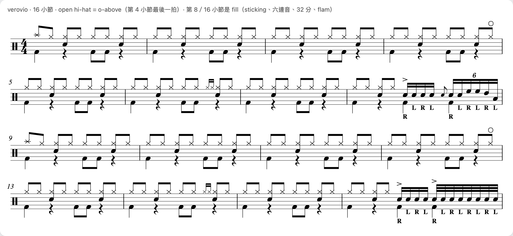
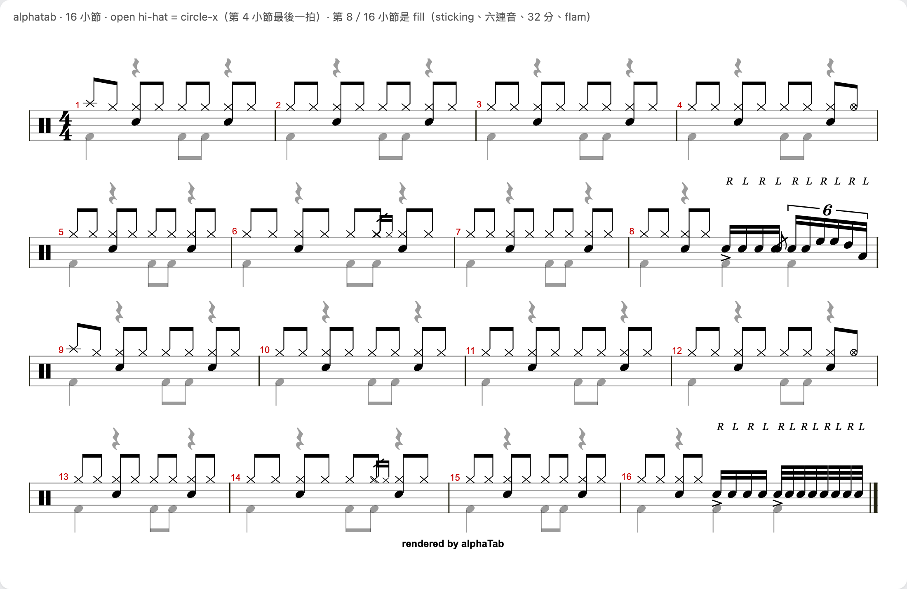
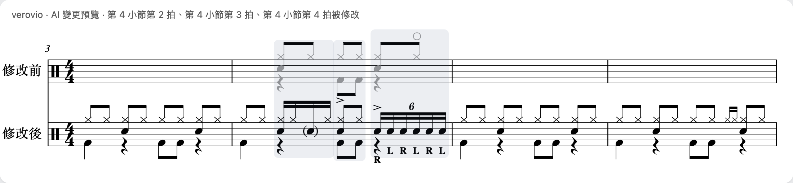
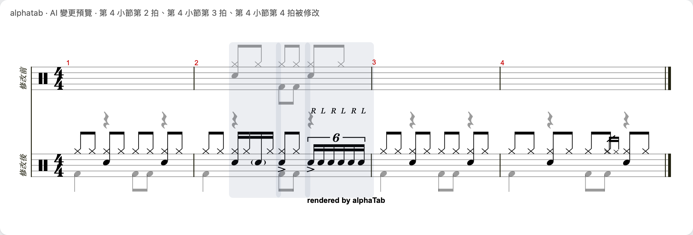
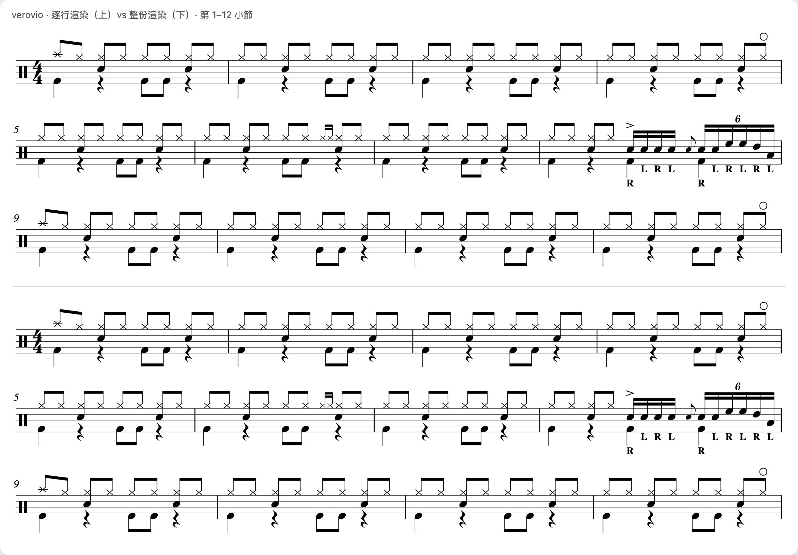
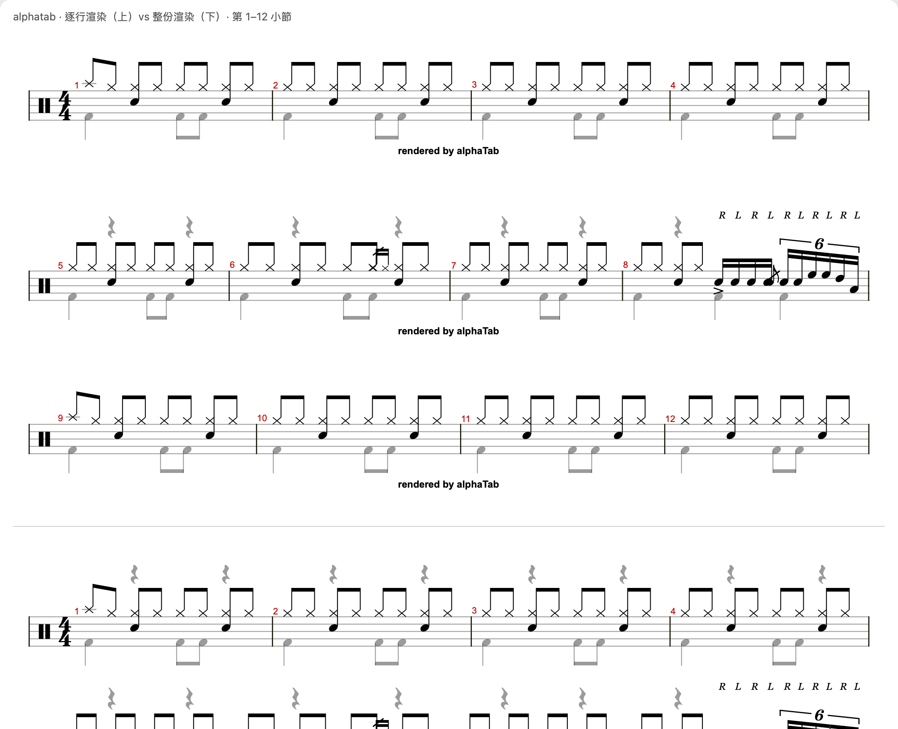

# 排版引擎 spike 結果：alphaTab vs Verovio（2026-10-05）

> 環境：Apple M2、macOS 27.2，Swift＋WKWebView 外殼（和正式架構相同：TS 核心跑在 WebView 裡）。alphaTab 1.8.4、Verovio 6.3.0（WASM）、TypeScript 7.0.2。
> 測試素材：程式產生的合成鼓譜，180／500／2000 小節，包含兩聲部、六連音、32 分、flam、drag、ghost、accent、open／closed hi-hat、hi-hat 踏板、sticking。
> 原始碼和重跑方式：`~/Desktop/sideproject/score-engine-spike/`（`./run.sh "test=…"`）。截圖、PDF、數據都在 `spike-2026-10/`。

## 結論

**spike 的結果和 research 的傾向相反：建議改用 Verovio，搭配逐行快取。**

- **鼓譜品質（G1、G5）：Verovio 明顯較好**，不用改原始碼就是一般鼓譜的寫法。alphaTab 有三個問題要改它的原始碼才能修：腳的休止符飄到譜表上方、重音畫在譜表下方、open hi-hat 的「o」畫不出來。這兩關最後要由你判斷。
- **速度（G2）：兩者搭配逐行快取都達標**。500 小節改一拍到畫面更新，p95 是 alphaTab 34 ms、Verovio 84 ms，目標是 < 100 ms。不用逐行快取的話，兩者都不達標。
- **逐行快取（G6）：Verovio 的逐行渲染和整份渲染看起來完全一樣**；alphaTab 兩種渲染結果不一致，每一行還會多一行「rendered by alphaTab」。
- **ID 對照（G4）**：Verovio 直接帶出我們的 ID；alphaTab 要自己做點擊判定，但做得到。

| 關卡 | alphaTab 1.8.4 | Verovio 6.3.0 |
|---|---|---|
| G1 鼓譜呈現 | ⚠️ 有 3 個問題要改原始碼（見下方） | ✅ 一般鼓譜寫法（待你確認） |
| G2 500 小節改一拍 < 100 ms | ✅ 逐行快取 34 ms／❌ 整份重排 116 ms | ✅ 逐行快取 84 ms／❌ 整份重排 583 ms |
| G3 diff 預覽 | ✅ 做得到，要自己算框 | ✅ 做得到，最接近 mockup |
| G4 ID 對照 | ✅ 要自己寫點擊判定 | ✅ ID 直接帶出 |
| G5 A4 PDF | ⚠️ 24 小節放不進一頁，頁尾有寫死的字樣 | ✅ 24 小節剛好一頁（待你確認） |
| G6 逐行快取 | ⚠️ 和整份渲染不一致 | ✅ 和整份渲染一致 |

## G1：鼓譜呈現（需要你判斷）

**Verovio**

- 腳的休止符在譜表下方。
- open hi-hat 的「o」在上方，sticking 在下方，重音在上方。
- drag、flam、六連音、32 分音符、crash 的加線都正確。
- 小缺點：sticking 的高度不一致。同一拍有大鼓時，那個 R 會被擠到比較低的位置。

**alphaTab**

1. **腳的休止符飄到譜表上方**。官方的「控制休止符位置」功能排在 1.9.0，還沒發行。
2. **重音記號畫在譜表下方**，靠近大鼓。
3. **open hi-hat 無法用「x 加上方 o」表示**。原始碼裡打擊樂上方記號只認 5 個寫死的符號（`PictEdgeOfCymbal`、`ArticStaccatoAbove`、`StringsUpBow`、`StringsDownBow`、`GuitarGolpe`），其他的會被忽略。只能改用 Guitar Pro 慣例的 circle-x（⊗），或者改它的原始碼。
4. sticking 只能用 `Beat.text` 寫在譜表上方。
5. 「rendered by alphaTab」頁尾是寫死的，設定關不掉。

## G2：大檔案的改一拍延遲

量測方式：改一拍的流程是「applyPatch → diff → 重排／重畫 → 等兩個畫面影格」。每種情境改 12 次，不計第一次。

| 引擎・模式 | 180 小節 | 500 小節 | 2000 小節 | 第一次畫出來 |
|---|---|---|---|---|
| alphaTab 逐行快取 | 33／90 | **33／34** | 48／67 | 67–100 ms |
| alphaTab 整份重排（官方 `AlphaTabApi`，lazy loading） | 50／67 | 70／116 | 233／283 | 84–284 ms |
| Verovio 逐行快取 | 83／84 | **67／84** | 83／84 | 266–317 ms |
| Verovio 整份重排（自動分頁，只重畫改到的那頁） | 268／284 | 550／583 | 2234／2333 | 333–2333 ms |

數字是 p50／p95，單位 ms。

- **約 33 ms 是量測的下限**：兩個畫面影格在 60 Hz 下大約 33 ms。
- **只重畫一行的成本**：alphaTab 約 1 ms，Verovio 約 14 ms。所以逐行快取模式下，Verovio 的時間和譜的長度無關。
- **alphaTab 逐行模式每次還要重建整份 model**：500 小節 9 ms，2000 小節 21 ms。之後可以改成只更新改到的小節。
- **diff 在任何大小都是 0–1 ms**：applyPatch 會保留沒改動的小節物件，diff 先比對物件是否相同（就像 React 的 `===`），再用 WeakMap 快取 hash。一開始沒做這兩件事時，2000 小節要 90 ms。
- **Verovio 整份模式一定要讓它自動分頁**（`breaks: 'line'`）。用 `encoded` 又沒寫換頁的話，整份譜會擠在同一頁，500 小節的 SVG 有 6.5 MB。

## G3：AI 變更預覽

- **Verovio**：
  - 寫法：產生一份兩個 staff 的 MEI。「修改前」staff 在沒改動的拍放 `<space>`，用 `@color` 設成灰色。
  - 時間對齊、小節編號（延續原本的第 3 小節）都由引擎處理。
  - 框是用 ID 找到元素再算範圍，三個框都正確。
- **alphaTab**：
  - 寫法：兩個 track。「修改前」沒改動的拍放透明的休止符（`Color` 支援 alpha，可行），改動的拍用 style 設成灰色。
  - 框要用 `boundsLookup` 自己算，這次算出來的框有重疊，演算法還要調整。
  - 小節編號從 1 開始，因為我用獨立的小 model 渲染；改用整份 model 加上 `startBar` 可以避免。

## G4：ID 對照

| | alphaTab | Verovio |
|---|---|---|
| 點擊 → 我們的音符 ID | 內建的 `getBeatAtPos`／`getNoteAtPos`：110／220（只看 x 座標，兩聲部疊在一起時會判成上聲部）；**自己寫「找最近的符頭」：220／220** | `elementFromPoint` → `g.note` 的 id：**220／220** |
| 播放時間 → 我們的事件 ID | MIDI tick lookup：**190／190** | `getElementsAtTime`：189／190（唯一的失誤回傳的是 flam 倚音的 ID `…g0`，換算回事件 ID 就對了） |
| AI patch 的新 ID 出現在輸出裡 | 6／6 | 6／6 |
| SVG 裡有沒有元素 ID | **有**：每一拍都有 `b{alphaTab 的編號}` class（220／220），可以用 CSS 高亮。這點和 research 報告說的「SVG 沒有元素 ID」不同 | **有**：直接是我們的 ID |

## G5：A4 PDF（需要你判斷）

檔案：`spike-2026-10/g5-verovio.pdf`、`spike-2026-10/g5-alphatab.pdf`。兩份都是 A4（794 × 1123 pt）、向量格式，字型內嵌。用的是 Mac 內建的 `WKWebView.createPDF`。

- **Verovio**：24 小節剛好放進一頁（6 行）。最後一小節的 fill 擠在一起，正好說明「某一行太擠時要局部重排」的設計是需要的。
- **alphaTab**：休止符飄在上方讓每一行變高，24 小節放不進一頁，第 21 小節之後被切掉。頁尾還有「rendered by alphaTab」。

## G6：逐行渲染和整份渲染一致嗎

- **Verovio**：每一行是一份獨立的小 MEI，非第一行用 `meter.visible="false"` 隱藏拍號，小節編號沿用原本的。結果和整份渲染**看起來完全一樣**，寬度、拍號、小節編號都對。
- **alphaTab**：用整份 model 加上 `startBar`／`barCount` 逐行渲染，拍號和小節編號都對。但每一行都多了「rendered by alphaTab」。更麻煩的是，**同一行在逐行和整份兩種模式下，腳的休止符一個有畫、一個沒畫**，結果不一致，快取就不可靠。

## 其他發現

- **cmux 會終止從它的終端機直接啟動的 GUI 程式**（送出 SIGTERM）。外殼包成 `.app`、改用 `open` 啟動才能跑。開發 Mac App 時要注意這點，或改用其他終端機啟動。
- 這台 Mac 只有 Command Line Tools、沒有 Xcode，用 SwiftPM 就能建出 WKWebView 外殼和 `.app`。
- 執行外殼需要暫時關掉 Claude Code 的 Bash 沙盒，因為要連到視窗伺服器、用 `open` 啟動。

## 沒有測到、還要確認的

- 實際的音訊播放：這次只測了「時間 → ID」的對照，沒有出聲音。Verovio 要自己接合成器，在 Mac 上可以用 `AVAudioSequencer` 加 `AVAudioUnitSampler` 播 Verovio 產生的 MIDI。
- 跨行的延音線、連結線：合成鼓譜裡沒有這類元素。
- Windows 的 WebView2：還沒做 Windows 版，沒測。
- 某一行太擠時的自動局部重排：設計還沒實作。
- 每種情境只跑了一輪（12 次改動），而且只在 M2 上測過。

## 建議的下一步

1. **你判斷 G1 和 G5**：看上面兩組截圖和兩份 PDF。
2. 如果你同意 Verovio：
   - 正式的引擎轉接用「CSM → MEI 產生器」，這次 spike 的 `adapters/verovio.ts` 可以當起點。
   - 編輯器用逐行快取。
   - 播放在 Mac 上走原生。
3. 如果你覺得 alphaTab 的畫面可以接受，或想保留它的速度和內建播放：要評估修改它原始碼的工作量，至少包括休止符位置、重音位置、「o」記號和頁尾。
